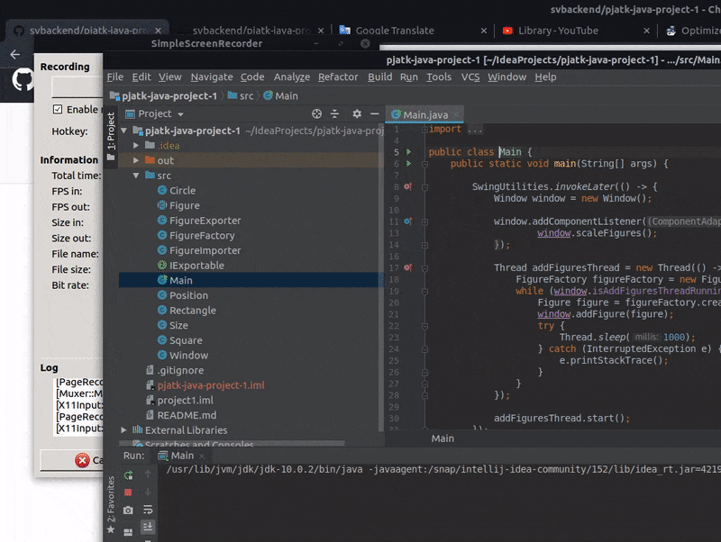

# pjatk-java-project-1

Java Swing responsible figures render + save to file + import from file

1. Scaling (+)
2. Add random figures (+)
3. Check is figure fit to the window size (+)
4. Make export from figure class to string and save it to file (+)
5. Create figure class from string (+)
6. Move each class to his own file (+)

